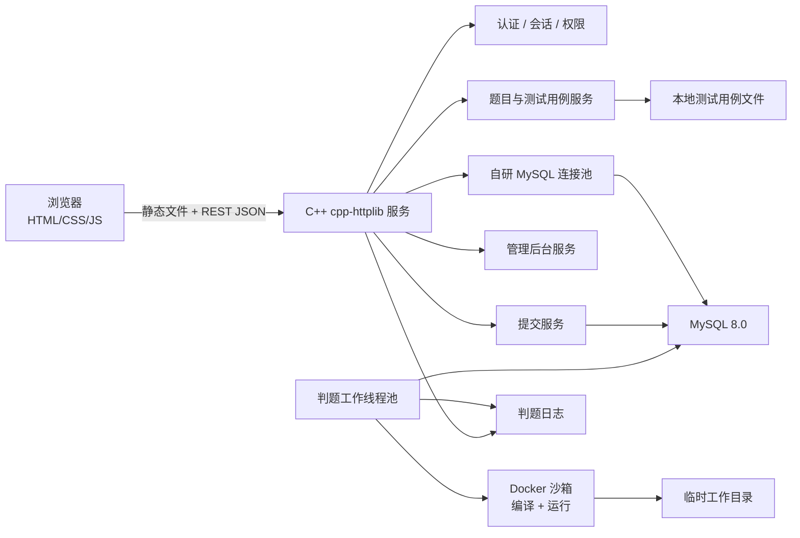
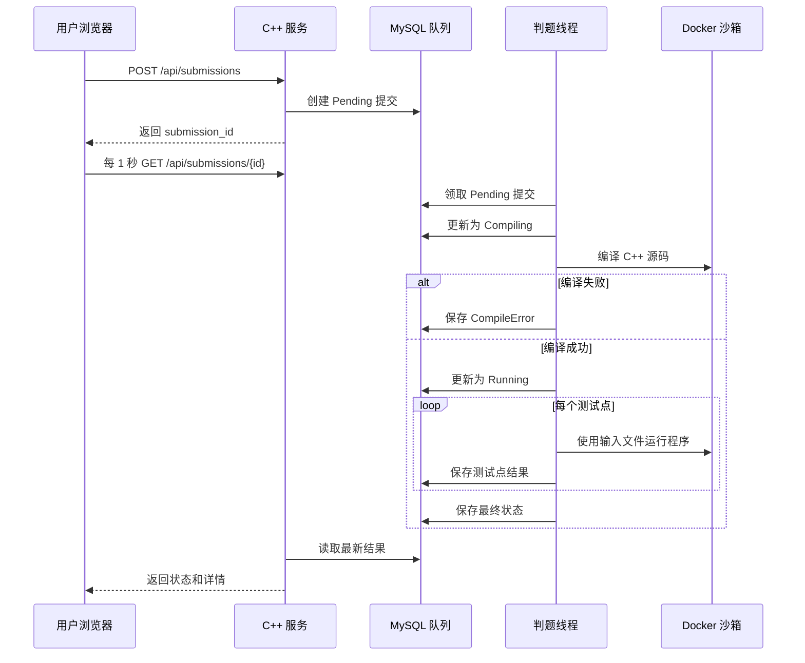

# 刷题平台 SPEC

> 状态：需求边界已确认，尚未进入编码实现
> 日期：2026-07-02

## 1. 项目目标

本项目要实现一个轻量级在线判题系统，形态接近 LeetCode / OJ 平台，但第一版定位为个人练手项目，并可支持小规模课堂或公网试用。MVP 不追求大而全，而是优先跑通完整主链路：注册、登录、浏览题目、提交 C++ 代码、Docker 沙箱判题、轮询结果、查看提交详情，以及管理员维护题目、测试用例、用户和全站提交记录。

技术上，后端使用 C++ 和 `cpp-httplib`，前端使用原生 HTML/CSS/JavaScript，数据库使用 MySQL 8.0。项目除了完成 OJ 业务，也要练习服务架构、Linux 进程与资源控制、数据库访问、队列式判题、基础安全和自动化测试。

## 2. MVP 范围

### 2.1 第一版必须包含

- 用户注册、登录、保持一段时间登录态、登出。
- 用户角色：普通用户、管理员、超级管理员。
- 注册用户默认为普通用户。
- 初始管理员或超级管理员通过数据库初始化或配置文件创建。
- 超级管理员可以在后台把普通用户提升为管理员。
- 题目列表支持标题关键字搜索、难度筛选、标签筛选。
- 题目详情包含标题、题面、输入描述、输出描述、样例输入输出、难度、标签。
- 判题模式只支持 ACM 标准输入输出。
- 提交语言只支持 C++。
- 用户提交代码后，前端通过轮询查看状态变化。
- 判题结果展示到每个测试点：状态、耗时、内存、错误类型。
- 编译错误可以展示给提交者，但必须做长度截断。
- 普通用户只能查看自己的提交。
- 管理员可以查看全站提交和任意用户提交源码。
- 管理员可以创建和编辑题目。
- 管理员可以通过 zip 上传测试用例。
- 测试用例 zip 内包含成对的 `.in/.out` 文件。
- 测试用例上传时要校验文件配对和命名，并尽可能给出详细失败原因。
- MVP 中测试用例上传采用“整包覆盖该题全部测试点”的方式。
- MySQL 8.0 存储业务数据和判题队列状态。
- 测试用例文件保存在服务器本地磁盘，MySQL 只存路径和元信息。
- 判题使用 Docker 作为沙箱。
- 后端服务、MySQL、Docker 判题环境部署在同一台 Linux 机器上。
- 同一个 C++ 服务同时托管静态前端文件和 REST JSON API。
- 注册、登录失败、提交、上传测试用例需要做基础防刷限制。
- 日志需要方便定位问题，至少区分访问日志、错误日志、判题日志。
- 提交源码短期保存 1 天，过期后删除源码和临时目录。
- 源码删除后，提交记录和结果元数据仍可保留。
- 服务或判题进程重启后，未完成的排队中、编译中、运行中提交要自动恢复为待判题并重新评测。
- Google Test 主要覆盖自研基础设施。
- 接口自动化同时保留两种方式：LLM 构造 `curl` 命令验证、Python `requests` 编写可重复测试用例。
- Web 自动化使用 Playwright 覆盖主链路。

### 2.2 第一版不做

- 排行榜。
- 题目通过率统计。
- 多语言提交。
- LeetCode 函数签名模式。
- 每道题单独配置时间和内存限制。
- 重判功能。
- 题目上下线状态。
- 单个测试点编辑或删除。
- 管理后台导出或备份能力。
- HTTPS、域名、Nginx 反向代理。
- 深色模式和复杂动画。
- 分布式判题服务。

## 3. 用户与权限

普通用户可以注册、登录、浏览题目、提交 C++ 代码、查看自己的提交历史和提交详情。

管理员可以管理题目和测试用例，管理用户，查看全站所有提交记录，并查看任意用户的提交源码。

超级管理员拥有管理员全部权限，并额外拥有用户提权能力。第一版可以通过数据库种子数据或配置文件创建初始超级管理员。

## 4. 核心业务流程

### 4.1 普通用户刷题流程

1. 用户用用户名和密码注册。
2. 用户登录，服务端创建会话。
3. 用户进入题目列表，通过标题、难度、标签筛选题目。
4. 用户打开题目详情页。
5. 用户在普通 `<textarea>` 中编写 C++ 代码。
6. 用户提交代码。
7. 后端创建提交记录，初始状态为 `Pending`。
8. 前端跳转到提交详情页，每 1 秒轮询一次提交状态。
9. 判题线程从 MySQL 队列领取提交，进入编译和运行流程。
10. 判题结束后，前端停止轮询并展示最终结果。
11. 用户查看每个测试点状态、耗时、内存和错误类型。
12. 用户可以在自己的提交记录页回看短期保存的源码。
13. 用户登出后，当前会话立即失效。

### 4.2 管理员流程

1. 管理员登录后台。
2. 管理员创建或编辑题目。
3. 管理员上传测试用例 zip，例如 `1.in/1.out`、`2.in/2.out`。
4. 后端校验 zip 文件结构、文件配对、路径安全、大小限制。
5. 如果校验失败，返回详细失败原因。
6. 如果校验成功，替换该题已有全部测试点。
7. 管理员查看测试点列表。
8. 管理员查看全站提交记录和提交源码。
9. 超级管理员可以把普通用户提升为管理员。

## 5. 前端规格

前端使用原生 HTML、CSS、JavaScript，不引入前端框架。静态文件由 C++ 后端服务托管。

第一版页面包括：

- 注册页。
- 登录页。
- 题目列表页。
- 题目详情与提交页。
- 我的提交页。
- 提交详情页。
- 管理员首页。
- 管理员题目列表与编辑页。
- 管理员测试用例上传与列表页。
- 管理员用户管理页。
- 管理员全站提交页。
- 登出入口。

页面风格参考 `https://datacollector.cn/`：白色背景、黑灰文字、细线边框、克制留白、工具型信息布局。刷题平台不要做营销型首页，第一屏应直接进入可用体验。界面重点是题面阅读、代码提交、表格筛选、状态反馈和错误定位。

UI 约束：

- 桌面优先，同时保证手机端可用。
- 第一版不做深色模式。
- 第一版不做复杂动画。
- 源码编辑器使用普通 `<textarea>`。
- 表单必须有可见 label。
- 错误信息尽量就近显示。
- 按钮、表格、表单、状态标签保持统一样式。
- 保证基础可访问性：文字对比度、键盘焦点、按钮可点击区域。
- API 错误统一由前端展示 `message` 字段。

## 6. 后端规格

后端使用 C++ 和 `cpp-httplib`。

后端职责：

- 托管前端静态文件。
- 提供 REST JSON API。
- 处理注册、登录、登出和会话校验。
- 执行基于角色的权限控制。
- 校验请求参数和上传文件。
- 通过自研 MVP 数据库连接池访问 MySQL。
- 管理用户、会话、题目、测试用例、提交、判题结果和限流数据。
- 创建提交记录并写入 MySQL 判题队列。
- 提供提交状态和详情查询接口，供前端轮询。
- 运行判题工作线程，或作为同仓库内伴随进程运行。
- 记录访问日志、错误日志和判题日志。

统一 API 响应结构：

```json
{
  "code": 0,
  "message": "ok",
  "data": {}
}
```

约定 `code = 0` 表示成功，非 0 表示失败。`message` 面向前端展示，`data` 可以包含业务数据或字段级错误信息。后端日志记录更详细的内部错误原因。

## 7. 判题规格

第一版只支持 ACM 标准输入输出。用户提交完整 C++ 程序，平台使用测试点输入文件运行程序，并比对标准输出。

提交状态：

- `Pending`：排队中。
- `Compiling`：编译中。
- `Running`：运行中。
- `Accepted`：通过。
- `WrongAnswer`：答案错误。
- `TimeLimitExceeded`：超时。
- `MemoryLimitExceeded`：内存超限。
- `RuntimeError`：运行时错误。
- `CompileError`：编译错误。
- `SystemError`：系统错误。

判题队列：

- MySQL 作为任务队列表。
- 判题线程从 MySQL 原子领取 `Pending` 提交。
- 同时允许 2 到 4 个判题任务运行。
- 额外提交继续排队。
- 服务重启时，将未完成的 `Pending`、`Compiling`、`Running` 提交恢复为待判题。

Docker 沙箱：

- MVP 允许后端直接调用 `docker run`。
- 每个提交使用独立临时工作目录。
- 容器需要限制 CPU、内存、进程数、文件系统和网络。
- 判题容器禁止访问网络。
- 每次判题结束后清理源码副本、可执行文件、输出文件和临时目录。

建议的保守默认限制：

- 源码大小：64 KB。
- 编译超时：10 秒。
- 单测试点运行超时：2 秒。
- 内存限制：128 MB。
- 单测试点输出大小上限：1 MB。
- 编译错误保存与展示上限：8 KB。
- 运行时 stderr 保存与展示上限：4 KB。
- 单题最多测试点：50 个。
- 测试用例 zip 最大：20 MB。
- 最大并发判题容器：4 个。
- 同一用户提交间隔：5 秒。

这些数值必须放进配置文件，后续可以不改代码直接调整。

## 8. 数据与文件存储

MySQL 8.0 存结构化数据，本地磁盘存测试用例和临时判题文件。

建议目录结构：

```text
shuati_platform/
  config/
    app.yaml
  data/
    testcases/
      problem_{id}/
        1.in
        1.out
        2.in
        2.out
    submissions/
      {yyyyMMdd}/
        submission_{id}/
          main.cpp
    judge_tmp/
      submission_{id}/
  logs/
    access.log
    error.log
    judge.log
  public/
    index.html
    assets/
  src/
  tests/
  third_party/
```

源码只保留 1 天。清理任务优先删除提交源码和 `judge_tmp` 临时目录。提交记录、最终状态、编译错误摘要、测试点结果等元数据可以继续保留，便于用户和管理员查看历史结果。

## 9. 数据库表建议

MVP 建议包含以下表：

- `users`：用户表，包含 `id`、`username`、`password_hash`、`role`、`status`、`created_at`、`updated_at`。
- `sessions`：会话表，包含 `id`、`user_id`、`token_hash`、`expires_at`、`revoked_at`、`created_at`、`last_seen_at`。
- `problems`：题目表，包含 `id`、`title`、`statement`、`input_description`、`output_description`、`samples_json`、`difficulty`、`tags_json`、`created_by`、`created_at`、`updated_at`。
- `testcases`：测试点表，包含 `id`、`problem_id`、`case_index`、`input_path`、`output_path`、`input_size`、`output_size`、`created_at`。
- `submissions`：提交表，包含 `id`、`user_id`、`problem_id`、`language`、`status`、`source_path`、`source_deleted_at`、`compile_message`、`total_time_ms`、`max_memory_kb`、`created_at`、`updated_at`。
- `submission_cases`：测试点结果表，包含 `id`、`submission_id`、`case_index`、`status`、`time_ms`、`memory_kb`、`error_type`、`message`、`created_at`。
- `rate_limits`：基础限流表，包含 `id`、`key_type`、`key_value`、`action`、`window_start`、`count`、`updated_at`。
- `audit_logs`：管理员操作审计表，包含 `id`、`actor_user_id`、`action`、`target_type`、`target_id`、`detail_json`、`created_at`。

索引需要覆盖登录、会话查找、题目筛选、用户提交列表、管理员提交列表、判题线程领取任务等高频路径。

## 10. 自研基础设施 MVP

为了练习底层工程能力，第一版包含若干自研组件，但都控制在 MVP 规模：

- 配置管理：实现基于 yaml 风格的配置读取，支持项目需要的 key-value 和简单层级。
- 日志库：支持日志级别、时间戳、文件输出，至少能区分访问、错误、判题日志。
- MySQL 连接池：固定大小连接池，支持阻塞获取、超时、RAII 自动归还。
- 会话管理：创建、校验、撤销、过期；数据库只保存 session token 哈希。
- 限流器：固定窗口限流，按 IP 或用户维度限制注册、登录失败、提交、上传。
- 判题工作池：固定工作线程数，从 MySQL 领取任务，支持服务退出时平滑停止。

进程、线程、锁、资源限制等优先使用 Linux 原生 API 或标准 C++ 能力。密码哈希优先使用 Ubuntu 系统包中的 bcrypt 方案；如果系统包不合适，再考虑引入源码依赖。

## 11. 系统架构





## 12. API 范围

代表性接口：

- `POST /api/auth/register`
- `POST /api/auth/login`
- `POST /api/auth/logout`
- `GET /api/auth/me`
- `GET /api/problems`
- `GET /api/problems/{id}`
- `POST /api/submissions`
- `GET /api/submissions`
- `GET /api/submissions/{id}`
- `GET /api/admin/users`
- `PATCH /api/admin/users/{id}/role`
- `GET /api/admin/problems`
- `POST /api/admin/problems`
- `PUT /api/admin/problems/{id}`
- `POST /api/admin/problems/{id}/testcases/upload`
- `GET /api/admin/problems/{id}/testcases`
- `GET /api/admin/submissions`
- `GET /api/admin/submissions/{id}`

所有 `/api/admin/*` 接口需要管理员或超级管理员权限。用户提权接口仅超级管理员可用。

## 13. 安全与防刷

- 密码必须使用 bcrypt 哈希保存。
- 数据库只保存 session token 的哈希，不保存明文 token。
- 如果使用 Cookie 保存登录态，Cookie 应设置 `HttpOnly`。
- 用户名规则建议：3 到 20 个字符，只允许字母、数字、下划线。
- 密码规则建议：至少 8 个字符，最长不超过 bcrypt 有效输入限制，至少包含字母和数字。
- 注册按 IP 限制频率。
- 登录失败按用户名和 IP 限制频率。
- 提交按用户和 IP 限制频率。
- 上传限制 zip 大小和解压后文件数量。
- zip 解压必须防止路径穿越。
- 普通用户不能看到测试输入、标准输出、实际输出。
- 编译错误和运行错误输出必须截断。
- 前端渲染用户内容必须转义，防止 XSS。
- SQL 必须使用预处理语句。
- Docker 容器禁止网络访问并限制文件系统。
- 判题临时目录必须清理。

## 14. 测试策略

Google Test 单元测试重点覆盖自研基础设施：

- 配置解析。
- 日志格式与文件写入。
- 连接池获取、归还、超时行为。
- 会话创建、校验、过期、撤销。
- 固定窗口限流。
- 提交状态流转辅助逻辑。
- 判题结果分类辅助逻辑。

接口自动化保留两类方式：

- 让 LLM 根据场景构造 `curl` 命令，快速验证接口和排查问题。
- 使用 Python `requests` 编写可重复执行的接口测试用例。

Web 自动化使用 Playwright 覆盖主链路：

- 注册。
- 登录。
- 浏览题目。
- 搜索和筛选题目。
- 提交 C++ 代码。
- 轮询判题结果。
- 查看提交详情。
- 管理员登录。
- 创建题目。
- 上传测试用例。
- 查看全站提交。
- 登出。

## 15. 开发协作与提交规范

每次完成一个可交付任务后，必须自动执行 Git 检查、本地提交，并推送到 GitHub。可交付任务包括但不限于：新增或修改规格文档、完成一个功能切片、修复一个 bug、补充测试、调整项目结构、更新部署说明或维护技术日志。

默认流程：

1. 确认工作区状态，避免把无关改动混入本次提交。
2. 运行与本次改动匹配的验证命令；如果无法运行，要在最终说明中写清原因。
3. 更新必要的技术日志、索引或说明文档。
4. 执行 `git add`、`git commit`。
5. 执行 `git push`，确保本地提交同步到 GitHub 远端。
6. 最终回复中说明提交哈希、GitHub 推送结果、改动位置、验证结果和遗留风险。

提交信息应简洁说明本次交付内容，例如 `docs: add oj platform spec`、`feat: add auth vertical slice`、`test: add config parser tests`。如果本次任务只完成访谈或纯分析、没有文件变更，则不需要创建空提交和空推送，但要明确说明没有提交的原因。若 GitHub 推送失败，必须说明失败原因，并把“待推送”作为遗留风险交代清楚。

## 16. 开发任务清单

- 创建项目目录结构和 CMake 基线。
- 将 `cpp-httplib` 放入 `third_party`。
- 编写 Ubuntu 依赖安装说明，覆盖 MySQL 客户端库、bcrypt、Docker。
- 选定 bcrypt 系统包或源码依赖。
- 实现配置读取。
- 实现日志库。
- 实现 MySQL 连接池。
- 创建数据库 schema 和超级管理员初始化脚本。
- 实现统一 API 响应辅助函数。
- 实现注册、登录、登出、会话校验。
- 实现 RBAC 权限控制。
- 实现静态文件托管。
- 实现题目列表和题目详情 API。
- 实现管理员题目管理 API。
- 实现测试用例 zip 校验和整包覆盖。
- 实现提交创建、提交列表、提交详情 API。
- 实现 MySQL 判题队列领取逻辑。
- 构建 C++ Docker 判题镜像。
- 实现编译、运行、输出比对和结果分类。
- 实现原生 HTML/CSS/JS 前端页面。
- 实现基础限流。
- 实现源码和临时目录清理。
- 添加 Google Test 单元测试。
- 添加 `curl` 调试示例和 Python `requests` 测试。
- 添加 Playwright 主链路测试。
- 添加 IP:端口 部署测试说明。

## 17. 验收标准

MVP 完成时应满足：

- 新用户可以注册、登录、保持一段时间登录态，并能登出。
- 普通用户可以浏览、搜索、筛选题目。
- 普通用户可以打开题目、提交 C++ 代码，并通过轮询看到状态变化。
- 系统能正确表示通过、答案错误、编译错误、超时、内存超限、运行时错误、系统错误。
- 提交详情展示最终状态和每个测试点的状态、耗时、内存、错误类型。
- 编译错误对提交者可见，但内容被截断。
- 普通用户不能查看其他用户的提交。
- 管理员可以创建和编辑题目。
- 管理员可以上传测试用例 zip，失败时看到详细校验原因，成功时覆盖该题全部测试点。
- 管理员可以查看全站提交记录和提交源码。
- 超级管理员可以把普通用户提升为管理员。
- 判题在 Docker 沙箱中运行，并限制资源和网络。
- 2 到 4 个提交可以并发判题，更多提交保持排队。
- 服务重启后，未完成任务可以恢复为待判题并重新评测。
- 源码清理任务在 1 天后删除源码和临时目录，且不影响结果查看。
- MySQL 表结构和本地文件目录结构清楚可复现。
- 注册、登录失败、提交、上传有基础限流。
- Google Test 覆盖自研基础设施 MVP。
- 接口可以通过 `curl` 和 Python `requests` 验证。
- Playwright 可以跑通用户和管理员主链路。
- 项目可以在一台 Linux 机器上通过 `http://IP:PORT` 访问。
- 每次完成可交付任务后，都有对应 Git 提交并同步推送到 GitHub；如无提交或推送失败，必须有明确原因。

## 18. 首轮实现建议

第一轮实现应采用纵向切片，而不是横向铺开所有模块。建议先完成：CMake、配置、日志、MySQL 连接、基础登录、一个初始化管理员、一个题目、一次测试用例上传、一次提交、一个判题线程、一个结果页面。端到端闭环跑通后，再补齐角色管理、筛选、限流、清理和自动化测试。

## 19. 方向盘 TODO 清单

这个清单用于把握项目节奏。每完成一组任务，都要更新勾选状态、补充技术日志，并提交 Git。

### P0：仓库与开发基线

- [ ] 确认 GitHub 远程仓库：`https://github.com/huachen19867/shuati_platform`。
- [ ] 将本地 `main` 首次推送到 GitHub：`git push -u origin main`。
- [ ] 创建基础目录：`src/`、`public/`、`config/`、`data/`、`logs/`、`tests/`、`third_party/`、`scripts/`。
- [ ] 建立 CMake 最小工程，能编译出后端可执行文件。
- [ ] 放入 `cpp-httplib` 单头文件，并记录来源和版本。
- [ ] 写 Ubuntu 依赖安装说明，覆盖 MySQL 客户端库、bcrypt、Docker、Google Test。
- [ ] 准备 `config/app.yaml` 示例配置。

### P1：最小可运行服务

- [ ] 实现配置读取 MVP。
- [ ] 实现日志 MVP：访问日志、错误日志、判题日志。
- [ ] 实现统一 JSON 响应结构 `{code, message, data}`。
- [ ] 实现静态文件托管。
- [ ] 实现健康检查接口。
- [ ] 提供一个最小 HTML 首页，确认浏览器能访问 `http://IP:PORT`。

### P2：数据库与账号闭环

- [ ] 设计并创建 MySQL schema。
- [ ] 实现自研固定大小 MySQL 连接池。
- [ ] 初始化超级管理员账号。
- [ ] 实现注册、登录、会话校验、登出。
- [ ] 实现 RBAC：普通用户、管理员、超级管理员。
- [ ] 实现用户提权接口，仅超级管理员可用。
- [ ] 用 Google Test 覆盖配置、日志、连接池、会话基础逻辑。

### P3：题库与测试用例管理

- [ ] 实现题目创建和编辑接口。
- [ ] 实现题目列表接口，支持标题、难度、标签筛选。
- [ ] 实现题目详情接口。
- [ ] 实现测试用例 zip 上传。
- [ ] 校验 `.in/.out` 配对、命名、大小、路径穿越。
- [ ] 上传成功后整包覆盖该题全部测试点。
- [ ] 后台展示测试点列表和上传校验结果。

### P4：提交与判题纵向切片

- [ ] 实现提交创建接口。
- [ ] 设计 MySQL 判题任务领取机制。
- [ ] 构建 C++ Docker 判题镜像。
- [ ] 实现编译流程和编译错误截断。
- [ ] 实现单测试点运行、超时、内存、输出大小限制。
- [ ] 实现输出比对和结果分类。
- [ ] 实现提交详情接口，返回最终状态和测试点结果。
- [ ] 前端提交后每 1 秒轮询，终态后停止。

### P5：前端主链路

- [ ] 注册页。
- [ ] 登录页。
- [ ] 题目列表页。
- [ ] 题目详情与提交页。
- [ ] 我的提交页。
- [ ] 提交详情页。
- [ ] 登出入口。
- [ ] 管理员题目管理页。
- [ ] 管理员测试用例上传页。
- [ ] 管理员用户管理页。
- [ ] 管理员全站提交页。
- [ ] 保持白色克制、工具型风格，参考 `https://datacollector.cn/`。

### P6：安全、限流与恢复

- [ ] bcrypt 密码哈希。
- [ ] session token 只存哈希。
- [ ] 注册限流。
- [ ] 登录失败限流。
- [ ] 提交频率限流。
- [ ] 上传大小和文件数量限制。
- [ ] Docker 禁止网络访问并限制资源。
- [ ] 服务重启后恢复未完成提交为待判题。
- [ ] 1 天后清理提交源码和临时目录。

### P7：测试与交付

- [ ] Google Test 覆盖自研基础设施 MVP。
- [ ] 整理常用 `curl` 验证命令。
- [ ] 编写 Python `requests` 接口自动化测试。
- [ ] 编写 Playwright 主链路测试。
- [ ] 写 IP:端口 部署测试说明。
- [ ] 每个阶段完成后更新技术日志。
- [ ] 每个阶段完成后执行验证、提交 Git，并推送到 GitHub。
